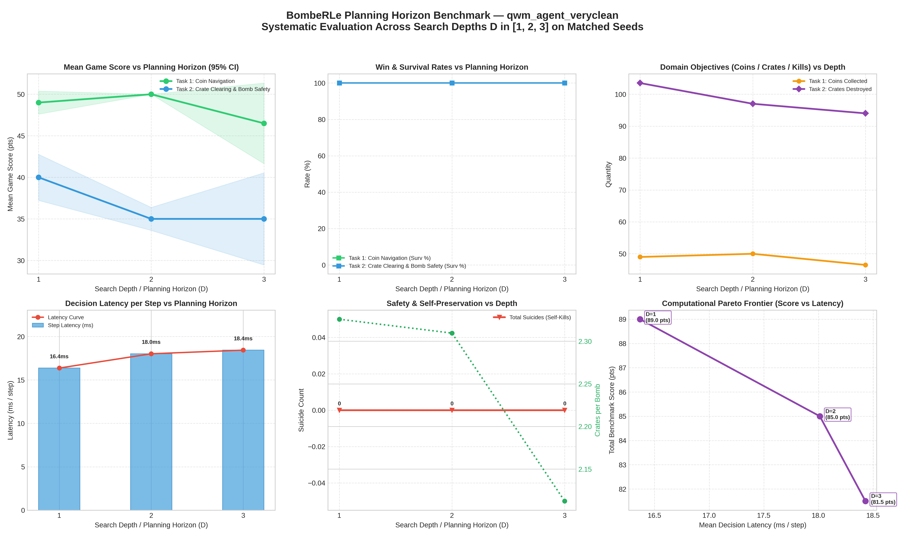

# BombeRLe Multi-Task Evaluation Report

**Reference:** `final_project.pdf` (Machine Learning Essentials, Summer-Semester 2026)

- **Generated:** `2026-09-22 21:22:12`
- **Evaluated Agents:** `qwm_agent_veryclean`

## 1. Executive Task Summary

The project handout defines 4 progressive tasks that agents must solve to attain full tournament readiness:

1. **Task 1: Coin Navigation** (`coin-heaven`, solo) — Efficient pathfinding and coin collection without bombs.
2. **Task 2: Crate Clearing & Bomb Safety** (`loot-crate`, solo) — Destroying crates, discovering coins, and escaping explosions with zero self-kills.
3. **Task 3: Hunting Passive & Collector Enemies** (`classic`, vs peaceful + coin_collector) — Eliminating moving adversaries while dodging counter-attacks.
4. **Task 4: Full Competitive Combat** (`classic`, vs 3x rule_based_agent) — Full tournament combat and beating the benchmark.

### Performance Summary: `qwm_agent_veryclean`

| Task | Scenario | Rounds | Win % | Surv % | Score | Coins | Crates | Kills | Suicides | Grade |
|:---|:---|---:|---:|---:|---:|---:|---:|---:|---:|:---:|
| **Task 1: Coin Navigation** | `coin-heaven` | 2 | **100.0%** | 100.0% | 46.50 | 46.5 | 0.0 | 0.00 | 0 | **A+** |
| **Task 2: Crate Clearing & Bomb Safety** | `loot-crate` | 2 | **100.0%** | 100.0% | 35.00 | 35.0 | 94.0 | 0.00 | 0 | **A+** |

#### Key Scientific KPIs: `qwm_agent_veryclean`

| Task Goal | Primary Metric | Efficiency & Safety Metric | Key Observation |
|:---|:---|:---|:---|
| **Task 1: Coin Navigation** | 46.5 coins / round | 7.8 steps / coin | High-speed coin navigation; 0.0% waits |
| **Task 2: Crate Clearing** | 94.0 crates destroyed | 2.11 crates / bomb | Zero Suicides (Safe); 100.0% survival |

## 4. Planning Horizon (Search Depth) Analysis

Systematic evaluation across planning horizons (search depths $D$) on identical matched random seeds, isolating the empirical impact of tree search lookahead on score, survival, resource gathering, and computational decision latency.

### Horizon Performance Breakdown: `qwm_agent_veryclean`

| Horizon (D) | Task 1: Coin Navigation | Task 2: Crate Clearing & Bomb Safety | Latency (ms/step) | Trade-Off Observation |
|:---:|:---:|:---:|:---:|:---:|
| **D = 1** | 49.0 coins (49.0 pts) | 103.5 cr (0 suic) | 16.4 ms | Baseline (Shallow) |
| **D = 2** | 50.0 coins (50.0 pts) | 97.0 cr (0 suic) | 18.0 ms | Horizon Overfit (-4.0 pts) |
| **D = 3** | 46.5 coins (46.5 pts) | 94.0 cr (0 suic) | 18.4 ms | Horizon Overfit (-3.5 pts) |

### Planning Horizon Visualizations: `qwm_agent_veryclean`

