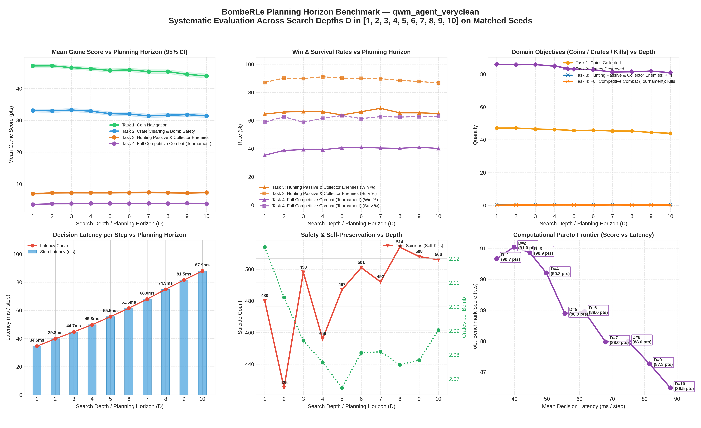

# BombeRLe Multi-Task Evaluation Report

**Reference:** `final_project.pdf` (Machine Learning Essentials, Summer-Semester 2026)

- **Generated:** `2026-09-23 14:12:53`
- **Evaluated Agents:** `qwm_agent_veryclean`

## 1. Executive Task Summary

The project handout defines 4 progressive tasks that agents must solve to attain full tournament readiness:

1. **Task 1: Coin Navigation** (`coin-heaven`, solo) — Efficient pathfinding and coin collection without bombs.
2. **Task 2: Crate Clearing & Bomb Safety** (`loot-crate`, solo) — Destroying crates, discovering coins, and escaping explosions with zero self-kills.
3. **Task 3: Hunting Passive & Collector Enemies** (`classic`, vs peaceful + coin_collector) — Eliminating moving adversaries while dodging counter-attacks.
4. **Task 4: Full Competitive Combat** (`classic`, vs 3x rule_based_agent) — Full tournament combat and beating the benchmark.

### Performance Summary: `qwm_agent_veryclean`

| Task | Scenario | Rounds | Win % | Surv % | Score | Coins | Crates | Kills | Suicides | Grade |
|:---|:---|---:|---:|---:|---:|---:|---:|---:|---:|:---:|
| **Task 1: Coin Navigation** | `coin-heaven` | 1000 | **100.0%** | 100.0% | 43.94 | 43.9 | 0.0 | 0.00 | 0 | **A+** |
| **Task 2: Crate Clearing & Bomb Safety** | `loot-crate` | 1000 | **99.8%** | 83.6% | 31.42 | 31.4 | 80.9 | 0.00 | 164 | **A+** |
| **Task 3: Hunting Passive & Collector Enemies** | `classic` | 1000 | **65.1%** | 86.7% | 7.31 | 4.3 | 50.6 | 0.60 | 104 | **B** |
| **Task 4: Full Competitive Combat (Tournament)** | `classic` | 1000 | **40.2%** | 63.1% | 3.82 | 2.6 | 27.9 | 0.25 | 238 | **A** |

#### Key Scientific KPIs: `qwm_agent_veryclean`

| Task Goal | Primary Metric | Efficiency & Safety Metric | Key Observation |
|:---|:---|:---|:---|
| **Task 1: Coin Navigation** | 43.9 coins / round | 7.0 steps / coin | High-speed coin navigation; 0.5% waits |
| **Task 2: Crate Clearing** | 80.9 crates destroyed | 2.09 crates / bomb | 164 suicides; 83.6% survival |
| **Task 3: Hunting Enemies** | 0.60 kills / round | 65.1% win rate | Neutralizes moving targets while evading blasts |
| **Task 4: Tournament Combat** | 40.2% win rate | Score Δ vs Rule-Based: +3.82 pts | Outperforms rule-based agent baseline |

## 4. Planning Horizon (Search Depth) Analysis

Systematic evaluation across planning horizons (search depths $D$) on identical matched random seeds, isolating the empirical impact of tree search lookahead on score, survival, resource gathering, and computational decision latency.

### Horizon Performance Breakdown: `qwm_agent_veryclean`

| Horizon (D) | Task 1: Coin Navigation | Task 2: Crate Clearing & Bomb Safety | Task 3: Hunting Passive & Collector Enemies | Task 4: Full Competitive Combat (Tournament) | Latency (ms/step) | Trade-Off Observation |
|:---:|:---:|:---:|:---:|:---:|:---:|:---:|
| **D = 1** | 47.1 coins (47.1 pts) | 86.0 cr (94 suic) | 64.6% win (6.92 pts) | 35.4% win (3.54 pts) | 34.5 ms | Baseline (Shallow) |
| **D = 2** | 47.1 coins (47.1 pts) | 85.7 cr (110 suic) | 66.1% win (7.18 pts) | 38.8% win (3.77 pts) | 39.8 ms | Moderate Gain (+0.4 pts) |
| **D = 3** | 46.6 coins (46.6 pts) | 85.8 cr (127 suic) | 66.4% win (7.23 pts) | 39.4% win (3.85 pts) | 44.7 ms | Diminishing Returns |
| **D = 4** | 46.2 coins (46.2 pts) | 84.8 cr (138 suic) | 66.3% win (7.22 pts) | 39.3% win (3.89 pts) | 49.8 ms | Horizon Overfit (-0.7 pts) |
| **D = 5** | 45.7 coins (45.7 pts) | 83.1 cr (151 suic) | 64.0% win (7.22 pts) | 40.7% win (3.91 pts) | 55.5 ms | Horizon Overfit (-1.3 pts) |
| **D = 6** | 45.8 coins (45.8 pts) | 82.7 cr (161 suic) | 66.3% win (7.28 pts) | 41.1% win (3.86 pts) | 61.5 ms | Diminishing Returns |
| **D = 7** | 45.3 coins (45.3 pts) | 81.3 cr (174 suic) | 68.7% win (7.38 pts) | 40.5% win (3.90 pts) | 68.0 ms | Horizon Overfit (-1.0 pts) |
| **D = 8** | 45.3 coins (45.3 pts) | 81.4 cr (160 suic) | 65.5% win (7.23 pts) | 40.3% win (3.85 pts) | 74.9 ms | Diminishing Returns |
| **D = 9** | 44.4 coins (44.4 pts) | 81.8 cr (154 suic) | 65.5% win (7.12 pts) | 41.1% win (3.93 pts) | 81.5 ms | Horizon Overfit (-0.7 pts) |
| **D = 10** | 43.9 coins (43.9 pts) | 80.9 cr (164 suic) | 65.1% win (7.31 pts) | 40.2% win (3.82 pts) | 87.9 ms | Horizon Overfit (-0.8 pts) |

### Planning Horizon Visualizations: `qwm_agent_veryclean`

