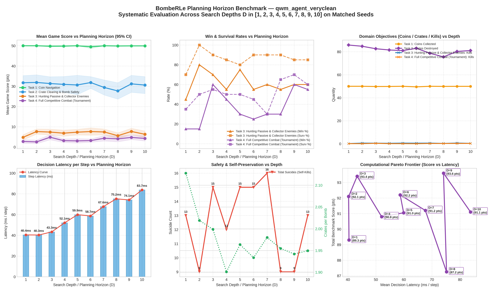

# BombeRLe Multi-Task Evaluation Report

**Reference:** `final_project.pdf` (Machine Learning Essentials, Summer-Semester 2026)

- **Generated:** `2026-09-23 18:20:29`
- **Evaluated Agents:** `qwm_agent_veryclean`

## 1. Executive Task Summary

The project handout defines 4 progressive tasks that agents must solve to attain full tournament readiness:

1. **Task 1: Coin Navigation** (`coin-heaven`, solo) — Efficient pathfinding and coin collection without bombs.
2. **Task 2: Crate Clearing & Bomb Safety** (`loot-crate`, solo) — Destroying crates, discovering coins, and escaping explosions with zero self-kills.
3. **Task 3: Hunting Passive & Collector Enemies** (`classic`, vs peaceful + coin_collector) — Eliminating moving adversaries while dodging counter-attacks.
4. **Task 4: Full Competitive Combat** (`classic`, vs 3x rule_based_agent) — Full tournament combat and beating the benchmark.

### Performance Summary: `qwm_agent_veryclean`

| Task | Scenario | Rounds | Win % | Surv % | Score | Coins | Crates | Kills | Suicides | Grade |
|:---|:---|---:|---:|---:|---:|---:|---:|---:|---:|:---:|
| **Task 1: Coin Navigation** | `coin-heaven` | 20 | **100.0%** | 100.0% | 49.95 | 50.0 | 0.0 | 0.00 | 0 | **A+** |
| **Task 2: Crate Clearing & Bomb Safety** | `loot-crate` | 20 | **100.0%** | 85.0% | 30.60 | 30.6 | 81.1 | 0.00 | 3 | **A+** |
| **Task 3: Hunting Passive & Collector Enemies** | `classic` | 20 | **60.0%** | 85.0% | 6.30 | 4.3 | 50.5 | 0.40 | 3 | **B** |
| **Task 4: Full Competitive Combat (Tournament)** | `classic` | 20 | **55.0%** | 60.0% | 4.25 | 2.8 | 27.8 | 0.30 | 7 | **A+** |

#### Key Scientific KPIs: `qwm_agent_veryclean`

| Task Goal | Primary Metric | Efficiency & Safety Metric | Key Observation |
|:---|:---|:---|:---|
| **Task 1: Coin Navigation** | 50.0 coins / round | 5.4 steps / coin | High-speed coin navigation; 0.4% waits |
| **Task 2: Crate Clearing** | 81.1 crates destroyed | 1.95 crates / bomb | 3 suicides; 85.0% survival |
| **Task 3: Hunting Enemies** | 0.40 kills / round | 60.0% win rate | Neutralizes moving targets while evading blasts |
| **Task 4: Tournament Combat** | 55.0% win rate | Score Δ vs Rule-Based: +4.25 pts | Outperforms rule-based agent baseline |

## 4. Planning Horizon (Search Depth) Analysis

Systematic evaluation across planning horizons (search depths $D$) on identical matched random seeds, isolating the empirical impact of tree search lookahead on score, survival, resource gathering, and computational decision latency.

### Horizon Performance Breakdown: `qwm_agent_veryclean`

| Horizon (D) | Task 1: Coin Navigation | Task 2: Crate Clearing & Bomb Safety | Task 3: Hunting Passive & Collector Enemies | Task 4: Full Competitive Combat (Tournament) | Latency (ms/step) | Trade-Off Observation |
|:---:|:---:|:---:|:---:|:---:|:---:|:---:|
| **D = 1** | 50.0 coins (50.0 pts) | 85.8 cr (2 suic) | 45.0% win (4.80 pts) | 15.0% win (2.75 pts) | 40.4 ms | Baseline (Shallow) |
| **D = 2** | 50.0 coins (50.0 pts) | 84.8 cr (2 suic) | 80.0% win (7.65 pts) | 15.0% win (2.55 pts) | 40.3 ms | Strong Gain (+2.8 pts) |
| **D = 3** | 49.8 coins (49.8 pts) | 82.7 cr (4 suic) | 70.0% win (7.40 pts) | 60.0% win (4.85 pts) | 43.3 ms | Moderate Gain (+1.3 pts) |
| **D = 4** | 49.9 coins (49.9 pts) | 81.5 cr (2 suic) | 55.0% win (6.85 pts) | 45.0% win (3.15 pts) | 52.1 ms | Horizon Overfit (-2.6 pts) |
| **D = 5** | 50.0 coins (50.0 pts) | 81.0 cr (4 suic) | 75.0% win (7.35 pts) | 30.0% win (3.05 pts) | 59.9 ms | Diminishing Returns |
| **D = 6** | 49.5 coins (49.5 pts) | 83.0 cr (3 suic) | 55.0% win (7.65 pts) | 25.0% win (3.20 pts) | 58.7 ms | Moderate Gain (+1.2 pts) |
| **D = 7** | 50.0 coins (50.0 pts) | 78.7 cr (6 suic) | 60.0% win (7.45 pts) | 30.0% win (4.35 pts) | 67.6 ms | Horizon Overfit (-1.0 pts) |
| **D = 8** | 49.9 coins (49.9 pts) | 75.5 cr (6 suic) | 55.0% win (5.60 pts) | 30.0% win (4.05 pts) | 75.2 ms | Horizon Overfit (-4.0 pts) |
| **D = 9** | 50.0 coins (50.0 pts) | 80.3 cr (4 suic) | 60.0% win (7.70 pts) | 60.0% win (4.75 pts) | 74.1 ms | Strong Gain (+6.4 pts) |
| **D = 10** | 50.0 coins (50.0 pts) | 81.1 cr (3 suic) | 60.0% win (6.30 pts) | 55.0% win (4.25 pts) | 83.7 ms | Horizon Overfit (-2.5 pts) |

### Planning Horizon Visualizations: `qwm_agent_veryclean`

