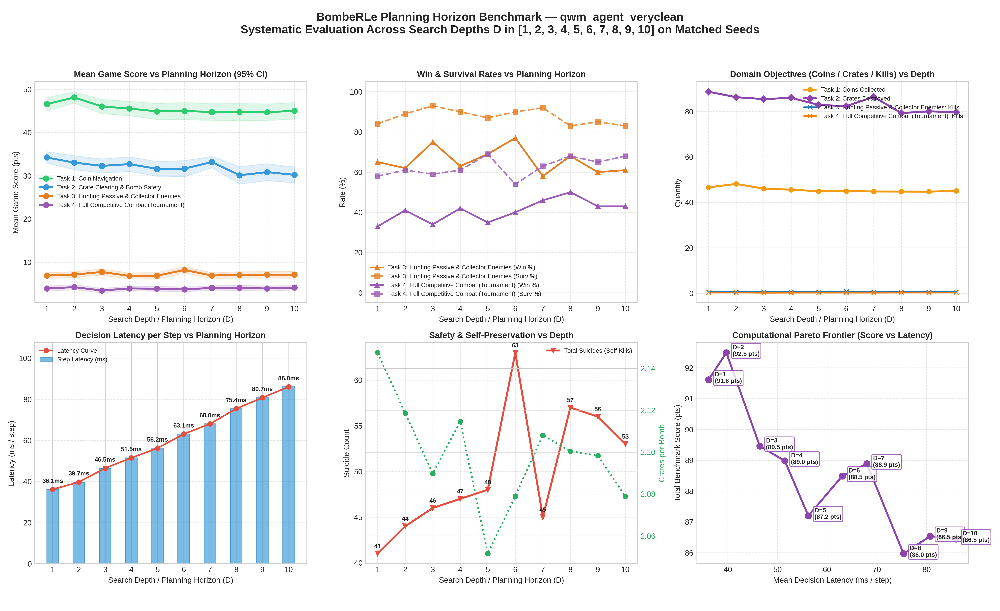
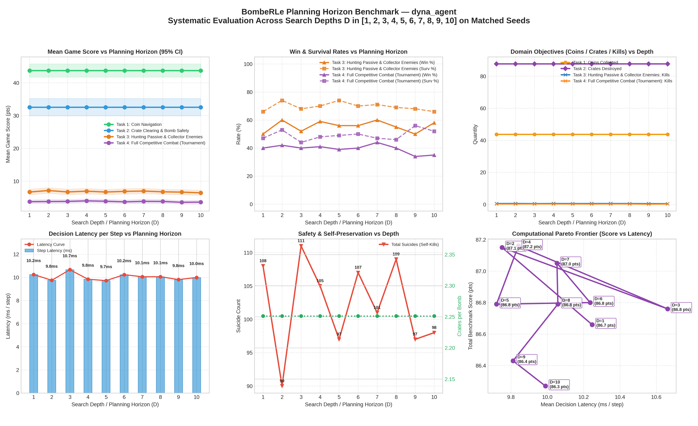

# BombeRLe Multi-Task Evaluation Report

**Reference:** `final_project.pdf` (Machine Learning Essentials, Summer-Semester 2026)

- **Generated:** `2026-09-22 23:14:08`
- **Evaluated Agents:** `qwm_agent_veryclean`, `dyna_agent`

## 1. Executive Task Summary

The project handout defines 4 progressive tasks that agents must solve to attain full tournament readiness:

1. **Task 1: Coin Navigation** (`coin-heaven`, solo) — Efficient pathfinding and coin collection without bombs.
2. **Task 2: Crate Clearing & Bomb Safety** (`loot-crate`, solo) — Destroying crates, discovering coins, and escaping explosions with zero self-kills.
3. **Task 3: Hunting Passive & Collector Enemies** (`classic`, vs peaceful + coin_collector) — Eliminating moving adversaries while dodging counter-attacks.
4. **Task 4: Full Competitive Combat** (`classic`, vs 3x rule_based_agent) — Full tournament combat and beating the benchmark.

### Performance Summary: `qwm_agent_veryclean`

| Task | Scenario | Rounds | Win % | Surv % | Score | Coins | Crates | Kills | Suicides | Grade |
|:---|:---|---:|---:|---:|---:|---:|---:|---:|---:|:---:|
| **Task 1: Coin Navigation** | `coin-heaven` | 100 | **100.0%** | 100.0% | 45.03 | 45.0 | 0.0 | 0.00 | 0 | **A+** |
| **Task 2: Crate Clearing & Bomb Safety** | `loot-crate` | 100 | **100.0%** | 82.0% | 30.21 | 30.2 | 79.7 | 0.00 | 18 | **A+** |
| **Task 3: Hunting Passive & Collector Enemies** | `classic` | 100 | **61.0%** | 83.0% | 7.10 | 4.4 | 49.9 | 0.54 | 16 | **B** |
| **Task 4: Full Competitive Combat (Tournament)** | `classic` | 100 | **43.0%** | 68.0% | 4.11 | 2.7 | 28.0 | 0.29 | 19 | **A** |

#### Key Scientific KPIs: `qwm_agent_veryclean`

| Task Goal | Primary Metric | Efficiency & Safety Metric | Key Observation |
|:---|:---|:---|:---|
| **Task 1: Coin Navigation** | 45.0 coins / round | 6.8 steps / coin | High-speed coin navigation; 0.4% waits |
| **Task 2: Crate Clearing** | 79.7 crates destroyed | 2.08 crates / bomb | 18 suicides; 82.0% survival |
| **Task 3: Hunting Enemies** | 0.54 kills / round | 61.0% win rate | Neutralizes moving targets while evading blasts |
| **Task 4: Tournament Combat** | 43.0% win rate | Score Δ vs Rule-Based: +4.11 pts | Outperforms rule-based agent baseline |

### Performance Summary: `dyna_agent`

| Task | Scenario | Rounds | Win % | Surv % | Score | Coins | Crates | Kills | Suicides | Grade |
|:---|:---|---:|---:|---:|---:|---:|---:|---:|---:|:---:|
| **Task 1: Coin Navigation** | `coin-heaven` | 100 | **100.0%** | 100.0% | 43.71 | 43.7 | 0.0 | 0.00 | 0 | **A+** |
| **Task 2: Crate Clearing & Bomb Safety** | `loot-crate` | 100 | **100.0%** | 68.0% | 32.54 | 32.5 | 87.6 | 0.00 | 32 | **A+** |
| **Task 3: Hunting Passive & Collector Enemies** | `classic` | 100 | **58.0%** | 66.0% | 6.43 | 4.2 | 53.3 | 0.44 | 31 | **B** |
| **Task 4: Full Competitive Combat (Tournament)** | `classic` | 100 | **35.0%** | 52.0% | 3.59 | 2.5 | 30.8 | 0.22 | 35 | **B** |

#### Key Scientific KPIs: `dyna_agent`

| Task Goal | Primary Metric | Efficiency & Safety Metric | Key Observation |
|:---|:---|:---|:---|
| **Task 1: Coin Navigation** | 43.7 coins / round | 9.0 steps / coin | High-speed coin navigation; 11.1% waits |
| **Task 2: Crate Clearing** | 87.6 crates destroyed | 2.25 crates / bomb | 32 suicides; 68.0% survival |
| **Task 3: Hunting Enemies** | 0.44 kills / round | 58.0% win rate | Neutralizes moving targets while evading blasts |
| **Task 4: Tournament Combat** | 35.0% win rate | Score Δ vs Rule-Based: +3.59 pts | Outperforms rule-based agent baseline |

## 2. Cross-Model Comparative Table (Section 6 Report Ready)

| Model / Architecture | Task 1 (Coins) | Task 2 (Crates / Suicides) | Task 3 (Kills / Win%) | Task 4 (Win% vs Rule-Based) | Overall Rating |
|:---|:---:|:---:|:---:|:---:|:---:|
| **`qwm_agent_veryclean`** | 45.0 (A+) | 79.7 cr (18 suic) | 0.54 k (61%) | 43.0% (4.1 pts) | **CHAMPION** |
| **`dyna_agent`** | 43.7 (A+) | 87.6 cr (32 suic) | 0.44 k (58%) | 35.0% (3.6 pts) | **CHAMPION** |

## 4. Planning Horizon (Search Depth) Analysis

Systematic evaluation across planning horizons (search depths $D$) on identical matched random seeds, isolating the empirical impact of tree search lookahead on score, survival, resource gathering, and computational decision latency.

### Horizon Performance Breakdown: `qwm_agent_veryclean`

| Horizon (D) | Task 1: Coin Navigation | Task 2: Crate Clearing & Bomb Safety | Task 3: Hunting Passive & Collector Enemies | Task 4: Full Competitive Combat (Tournament) | Latency (ms/step) | Trade-Off Observation |
|:---:|:---:|:---:|:---:|:---:|:---:|:---:|
| **D = 1** | 46.6 coins (46.6 pts) | 88.7 cr (8 suic) | 65.0% win (6.90 pts) | 33.0% win (3.90 pts) | 36.1 ms | Baseline (Shallow) |
| **D = 2** | 48.1 coins (48.1 pts) | 86.3 cr (13 suic) | 62.0% win (7.12 pts) | 41.0% win (4.21 pts) | 39.7 ms | Moderate Gain (+0.9 pts) |
| **D = 3** | 46.0 coins (46.0 pts) | 85.5 cr (16 suic) | 75.0% win (7.72 pts) | 34.0% win (3.43 pts) | 46.5 ms | Horizon Overfit (-3.0 pts) |
| **D = 4** | 45.6 coins (45.6 pts) | 86.0 cr (15 suic) | 63.0% win (6.81 pts) | 42.0% win (3.92 pts) | 51.5 ms | Horizon Overfit (-0.5 pts) |
| **D = 5** | 44.9 coins (44.9 pts) | 82.9 cr (17 suic) | 69.0% win (6.85 pts) | 35.0% win (3.84 pts) | 56.2 ms | Horizon Overfit (-1.8 pts) |
| **D = 6** | 45.0 coins (45.0 pts) | 82.3 cr (16 suic) | 77.0% win (8.19 pts) | 40.0% win (3.68 pts) | 63.1 ms | Moderate Gain (+1.3 pts) |
| **D = 7** | 44.8 coins (44.8 pts) | 86.4 cr (13 suic) | 58.0% win (6.90 pts) | 46.0% win (4.04 pts) | 68.0 ms | Moderate Gain (+0.4 pts) |
| **D = 8** | 44.8 coins (44.8 pts) | 79.3 cr (23 suic) | 68.0% win (7.05 pts) | 50.0% win (4.06 pts) | 75.4 ms | Horizon Overfit (-2.9 pts) |
| **D = 9** | 44.7 coins (44.7 pts) | 80.1 cr (18 suic) | 60.0% win (7.10 pts) | 43.0% win (3.89 pts) | 80.7 ms | Moderate Gain (+0.6 pts) |
| **D = 10** | 45.0 coins (45.0 pts) | 79.7 cr (18 suic) | 61.0% win (7.10 pts) | 43.0% win (4.11 pts) | 86.0 ms | Diminishing Returns |

### Planning Horizon Visualizations: `qwm_agent_veryclean`

### Horizon Performance Breakdown: `dyna_agent`

| Horizon (D) | Task 1: Coin Navigation | Task 2: Crate Clearing & Bomb Safety | Task 3: Hunting Passive & Collector Enemies | Task 4: Full Competitive Combat (Tournament) | Latency (ms/step) | Trade-Off Observation |
|:---:|:---:|:---:|:---:|:---:|:---:|:---:|
| **D = 1** | 43.7 coins (43.7 pts) | 87.6 cr (32 suic) | 50.0% win (6.68 pts) | 40.0% win (3.73 pts) | 10.2 ms | Baseline (Shallow) |
| **D = 2** | 43.7 coins (43.7 pts) | 87.6 cr (32 suic) | 60.0% win (7.13 pts) | 42.0% win (3.77 pts) | 9.8 ms | Moderate Gain (+0.5 pts) |
| **D = 3** | 43.7 coins (43.7 pts) | 87.6 cr (32 suic) | 52.0% win (6.70 pts) | 40.0% win (3.81 pts) | 10.7 ms | Horizon Overfit (-0.4 pts) |
| **D = 4** | 43.7 coins (43.7 pts) | 87.6 cr (32 suic) | 59.0% win (6.93 pts) | 41.0% win (3.98 pts) | 9.8 ms | Moderate Gain (+0.4 pts) |
| **D = 5** | 43.7 coins (43.7 pts) | 87.6 cr (32 suic) | 56.0% win (6.68 pts) | 39.0% win (3.86 pts) | 9.7 ms | Horizon Overfit (-0.4 pts) |
| **D = 6** | 43.7 coins (43.7 pts) | 87.6 cr (32 suic) | 56.0% win (6.87 pts) | 40.0% win (3.68 pts) | 10.2 ms | Diminishing Returns |
| **D = 7** | 43.7 coins (43.7 pts) | 87.6 cr (32 suic) | 60.0% win (6.97 pts) | 44.0% win (3.83 pts) | 10.1 ms | Diminishing Returns |
| **D = 8** | 43.7 coins (43.7 pts) | 87.6 cr (32 suic) | 55.0% win (6.74 pts) | 40.0% win (3.80 pts) | 10.1 ms | Diminishing Returns |
| **D = 9** | 43.7 coins (43.7 pts) | 87.6 cr (32 suic) | 50.0% win (6.64 pts) | 34.0% win (3.54 pts) | 9.8 ms | Horizon Overfit (-0.4 pts) |
| **D = 10** | 43.7 coins (43.7 pts) | 87.6 cr (32 suic) | 58.0% win (6.43 pts) | 35.0% win (3.59 pts) | 10.0 ms | Diminishing Returns |

### Planning Horizon Visualizations: `dyna_agent`

